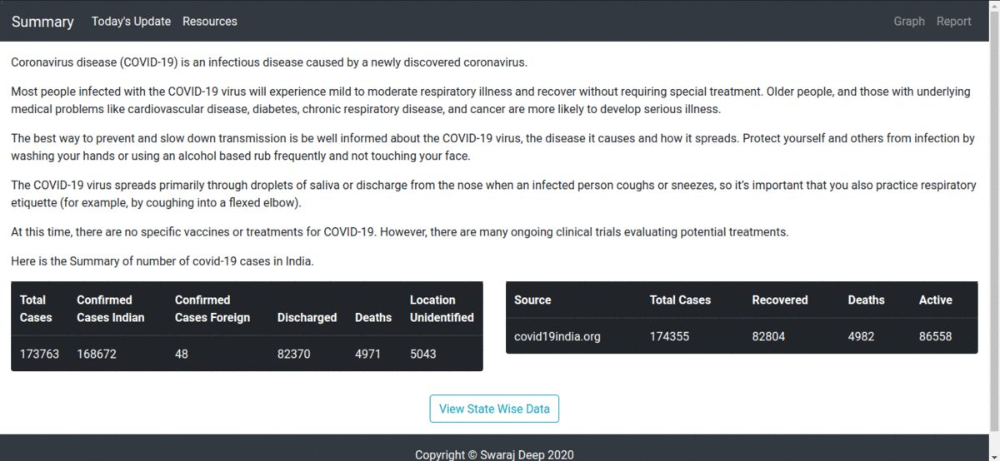

# Covid-19 Tracker

This tracker is made with python which uses data from certain apis. This tracker is for use in India only. This tracker has a choropleth map of India which visualizes the spread of covid-19 virus in Indian states. You can click on the states to get a detailed information about the condition of your state on a district level scale. You can also check out the resources available in your district.

## Requirements

[python version 3.x](https://www.python.org/download/releases/3.0/)  
[flask version 1.1.x](https://pypi.org/project/Flask/)

## Installment

Once you have python and flask installed on your system you are ready to go. Clone this repopsitory on your system using the following command:

``` git
git clone https://github.com/Swaraj-Deep/covid-19-tracker.git
```

## Exceution

Once the repository is cloned go to the webapp folder and run the [main.py](/) file using the following command:

``` bash
python3 main.py
```

## Screen Shots

  
  
  


## Licence

[MIT](https://opensource.org/licenses/MIT)
